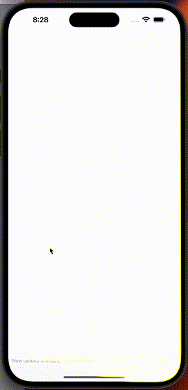

Skeleton Animation in React Native with Moti 🐾

<h1 align="center">Skeleton Animation</h1>
 

</img>

Enspired by the [tutorial](https://www.youtube.com/watch?v=vunwBbFx_F8) from Reactiive YouTube channel.

## Quick start

1. Clone the repo.
3. Change directory to your project with `cd skeleton-animation` command.
4. Run `yarn start` to start the Metro bundler.
5. Press `i` to start the iOS simulator or `a` to run the Android emulator.📱

Please use the `npx expo eject` command to switch to the "bare" react-native app. See the [docs](https://docs.expo.dev/introduction/managed-vs-bare/) to learn about the difference between managed and bare workflows.

Happy hacking! 🤓

## Available commands

- `yarn start` - start Metro Bundler.
- `yarn ios` - run on iOS.
- `yarn android` - run on Android.
- `yarn web` - run on web.
- `yarn lint` - check code for errors.
- `yarn release` - generate a changelog, bump the version of app and create a new tag.
- `yarn test` - run tests.
